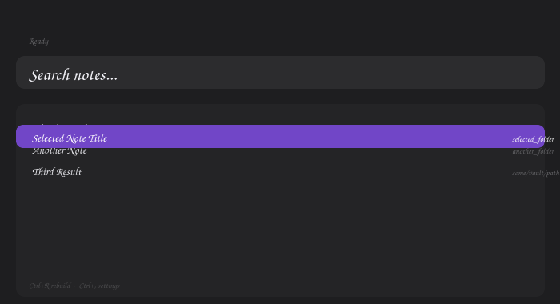

# Obsidian Launcher

A keyboard-driven GUI launcher and search tool for Obsidian vaults, inspired by [Vicinae](https://docs.vicinae.com/).



## Features

- **Instant full-text search** across your entire Obsidian vault using `tantivy` with ngram tokenization
- **Spotlight-style floating window** with rounded corners, built with `iced`
- **Live re-indexing** via file watcher (`notify`) — no manual rebuild needed
- **Global hotkey daemon** (`evdev`) — works on X11 and Wayland
- **Keyboard navigation** (↑↓ to select, Enter to open, Esc to close)
- **Obsidian URI integration** — opens notes directly in Obsidian
- **Search highlighting** — passes the query to Obsidian for in-document highlighting
- **Click to open** — results are clickable with a mouse
- **Custom SVG icons** — folder and settings icons
- **Settings UI** — configure vault path, max results, and hotkey from the GUI

## Installation

```bash
cargo build --release
```

The binary will be at `target/release/obsidian-launcher`.

## Configuration

Config file at `~/.config/obsidian-launcher/config.toml` (auto-created on first launch):

```toml
vault_path = "/path/to/your/vault"
max_results = 50
hotkey = "Super+Space"
```

## Usage

```bash
./target/release/obsidian-launcher
```

Or install the binary:
```bash
cp target/release/obsidian-launcher ~/.cargo/bin/
obsidian-launcher
```

### Controls

| Key | Action |
|-----|--------|
| `↑` / `↓` | Navigate results |
| `Enter` | Open selected note |
| `Esc` | Close app |
| `Ctrl+R` | Rebuild search index |
| `Ctrl+,` | Open settings |

### Global Hotkey (Wayland/X11)

The app includes a **daemon** that listens for a global hotkey via `evdev` (works on X11 and Wayland).

**Automatic setup:**
```bash
chmod +x setup-daemon.sh
./setup-daemon.sh
```

**Manual setup:**
```bash
# 1. Build and install the daemon
cargo build --release --bin obsidian-hotkey-daemon
cp target/release/obsidian-hotkey-daemon ~/.cargo/bin/

# 2. Configure hotkey in ~/.config/obsidian-launcher/config.toml
#    hotkey = "Super+Space"

# 3. Install systemd user service
mkdir -p ~/.config/systemd/user/
cp obsidian-hotkey-daemon.service ~/.config/systemd/user/
systemctl --user daemon-reload
systemctl --user enable --now obsidian-hotkey-daemon

# 4. Check status
systemctl --user status obsidian-hotkey-daemon
journalctl --user -u obsidian-hotkey-daemon -f
```

**Note:** The daemon reads `/dev/input/event*` directly for key capture. If you have permission issues, add yourself to the `input` group:
```bash
sudo usermod -aG input $USER
```

You'll also need `xdotool` or `wmctrl` for window focus support on X11:
```bash
sudo pacman -S xdotool wmctrl   # Arch
sudo apt install xdotool wmctrl  # Debian/Ubuntu
```

## Architecture

```
src/
├── main.rs            # App entry point
├── lib.rs             # GUI state machine, views, application logic
├── config.rs          # Config load/save (TOML)
├── index.rs           # Tantivy full-text search index
├── vault.rs           # Vault scanning and .md parsing
├── watcher.rs         # File watcher with debounce
├── hotkey_daemon.rs   # Global hotkey daemon (evdev)
└── bin/
    ├── hotkey-daemon.rs  # Daemon binary entry point
    └── test_search.rs    # Search test/debug binary
```

**Binaries:**
- `obsidian-launcher` — GUI search application
- `obsidian-hotkey-daemon` — Background hotkey listener daemon
- `test_search` — Command-line search test tool

## Development

```bash
# Run tests
cargo test

# Build in debug mode
cargo build

# Build in release mode
cargo build --release
```

## TODO

- [ ] Floating borderless window (Spotlight style) with `gtk-layer-shell`
- [x] Wikilink `[[...]]` search support — parsed, indexed, searchable
- [ ] AppImage / deb packaging
