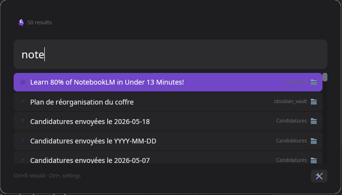

# Obsidian Launcher

A keyboard-driven GUI launcher and search tool for Obsidian vaults.



## Features

- **Instant full-text search** across your entire Obsidian vault using `tantivy`
  - **Ngram tokenization** (1–15) for fuzzy / prefix / typo-tolerant matching
  - **French stemmer** — searches for *rechercher* also find *recherche*, *recherchons*, etc.
  - Dual-indexing: ngram fields + French-stemmed fields for best recall
- **Spotlight-style floating overlay** — borderless, transparent, always‑on‑top
  - Centered at top of screen, rounded corners, dark theme
  - KDE Plasma: auto‑configured via KWin rules (keep‑above + all‑desktops)
  - Wayland `wlr-layer-shell` detection
- **Live re-indexing** via file watcher (`notify`) — no manual rebuild needed
- **Global hotkey daemon** (`evdev`) — works on X11 and Wayland
  - Handles keyboard disconnection/reconnection (periodic rescan)
- **Infinite scroll** — progressively reveals results as you navigate down
- **Keyboard navigation** (↑↓ to select, Enter to open, Esc to close, Ctrl+R rebuild, Ctrl+, settings)
- **Obsidian URI integration** — opens notes directly in Obsidian
- **Search highlighting** — passes the query to Obsidian for in-document highlighting
- **Click to open** — results are clickable with a mouse
- **Wikilink `[[…]]` search support** — indexed and searchable
- **Settings UI** — configure vault path, max results, and hotkey from the GUI
- **Error handling** — search errors, watcher errors, and config fallbacks all visible in the UI
- **Single‑instance** — only one instance runs; triggering the hotkey re‑focuses the existing window

## Installation

### AppImage (recommended)

Download the latest `Obsidian-Launcher-x86_64.AppImage` from the [releases page](https://github.com/limbsjones/obsidian-launcher/releases).

```bash
chmod +x Obsidian-Launcher-x86_64.AppImage
./Obsidian-Launcher-x86_64.AppImage
```

Optionally install system-wide:
```bash
sudo cp Obsidian-Launcher-x86_64.AppImage /usr/local/bin/obsidian-launcher
```

### From source

```bash
cargo build --release
```

The binary will be at `target/release/obsidian-launcher`.

## Configuration

Config file at `~/.config/obsidian-launcher/config.toml` (auto-created on first launch):

```toml
vault_path = "/path/to/your/vault"
max_results = 50
hotkey = "Shift+Super+Space"
```

### Settings

| Setting | Default | Description |
|---------|---------|-------------|
| `vault_path` | *(none)* | Path to your Obsidian vault |
| `max_results` | `50` | Max search results (1–500) |
| `hotkey` | `""` | Global hotkey, e.g. `Super+Space`, `Shift+Super+Space` |

The settings UI (Ctrl+,) lets you change these at runtime.

## Usage

```bash
./target/release/obsidian-launcher
```

Or install the binary:
```bash
cp target/release/obsidian-launcher ~/.cargo/bin/
obsidian-launcher
```

### Controls

| Key | Action |
|-----|--------|
| `↑` / `↓` | Navigate results |
| `Enter` | Open selected note |
| `Esc` | Close app |
| `Ctrl+R` | Rebuild search index |
| `Ctrl+,` | Open settings |

### Global Hotkey (Wayland / X11)

The app includes a **daemon** that listens for a global hotkey via `evdev`.

**Automatic setup:**
```bash
chmod +x setup-daemon.sh
./setup-daemon.sh
```

**Manual setup:**
```bash
# 1. Build and install the daemon
cargo build --release --bin obsidian-hotkey-daemon
cp target/release/obsidian-hotkey-daemon ~/.cargo/bin/

# 2. Configure hotkey in ~/.config/obsidian-launcher/config.toml
#    hotkey = "Super+Space"

# 3. Install systemd user service
mkdir -p ~/.config/systemd/user/
cp obsidian-hotkey-daemon.service ~/.config/systemd/user/
systemctl --user daemon-reload
systemctl --user enable --now obsidian-hotkey-daemon

# 4. Check status
systemctl --user status obsidian-hotkey-daemon
journalctl --user -u obsidian-hotkey-daemon -f
```

**Note:** The daemon reads `/dev/input/event*` directly. If you have permission issues, ensure your user is in the `input` group:
```bash
sudo usermod -aG input $USER
```

You'll also need `xdotool` or `wmctrl` for window focus support on X11:
```bash
sudo pacman -S xdotool wmctrl   # Arch
sudo apt install xdotool wmctrl  # Debian/Ubuntu
```

## Wayland per‑compositor notes

| Compositor | Support |
|-----------|---------|
| **KDE Plasma** | Auto‑configured via KWin rules (keep‑above, all‑desktops) |
| **Sway** | Add a window rule: `for_window [app_id="obsidian-launcher"] move position 0 0, resize set 700 400` |
| **Hyprland** | Add a window rule in `hyprland.conf` |
| **wlr‑layer‑shell** | Detected automatically; add a compositor rule for true overlay |

## Architecture

```
src/
├── main.rs            # App entry point
├── lib.rs             # GUI state machine, views, application logic
├── config.rs          # Config load/save (TOML)
├── index.rs           # Tantivy full-text search index (ngram + French stemmer)
├── layer_shell.rs     # Wayland wlr-layer-shell detection + KWin D-Bus rules
├── vault.rs           # Vault scanning and .md parsing
├── watcher.rs         # File watcher with debounce
├── hotkey_daemon.rs   # Global hotkey daemon (evdev) with reconnect support
└── bin/
    ├── hotkey-daemon.rs  # Daemon binary entry point
    └── test_search.rs    # Search test/debug binary
```

**Binaries:**
- `obsidian-launcher` — GUI search application (31 MB release)
- `obsidian-hotkey-daemon` — Background hotkey listener daemon
- `test_search` — Command-line search test tool

## Development

```bash
# Run tests
cargo test

# Build in debug mode
cargo build

# Build in release mode
cargo build --release

# Create AppImage (requires appimagetool)
./build-appimage.sh
```

## Packages / Distribution

- **AppImage** — portable single‑file executable (see [Releases](https://github.com/limbsjones/obsidian-launcher/releases))
- **AUR** — planned
- **deb / rpm** — planned

## Omarchy

To add Obsidian Launcher to the **Omarchy** app launcher ([Walker](https://github.com/abenz1267/walker), `Super + Space`) :

### 1. Install the binary

**Option A — AppImage (recommended)** :
```bash
# Download from https://github.com/limbsjones/obsidian-launcher/releases
chmod +x Obsidian-Launcher-x86_64.AppImage
sudo cp Obsidian-Launcher-x86_64.AppImage /usr/local/bin/obsidian-launcher
```

**Option B — build from source** :
```bash
cp target/release/obsidian-launcher ~/.cargo/bin/
```

### 2. Install the icon

```bash
mkdir -p ~/.local/share/applications/icons
cp obsidian-launcher.png ~/.local/share/applications/icons/
# Also install in the hicolor theme for general compatibility
mkdir -p ~/.local/share/icons/hicolor/48x48/apps
cp obsidian-launcher.png ~/.local/share/icons/hicolor/48x48/apps/
gtk-update-icon-cache ~/.local/share/icons/hicolor &>/dev/null
```

### 3. Install the `.desktop` file

```bash
mkdir -p ~/.local/share/applications
sed 's|^Icon=.*|Icon=~/.local/share/applications/icons/obsidian-launcher.png|' \
    obsidian-launcher.desktop > ~/.local/share/applications/obsidian-launcher.desktop
chmod +x ~/.local/share/applications/obsidian-launcher.desktop
update-desktop-database ~/.local/share/applications
```

### 4. Alternative — Omarchy bundle

To make the `.desktop` survive `omarchy-refresh-applications` (managed as a first-party Omarchy bundle) :

```bash
mkdir -p ~/.local/share/omarchy/applications
sed 's|^Icon=.*|Icon=~/.local/share/applications/icons/obsidian-launcher.png|' \
    obsidian-launcher.desktop > ~/.local/share/omarchy/applications/obsidian-launcher.desktop
omarchy-refresh-applications
```

> 💡 **AppImage note** : if the AppImage lives at `/usr/local/bin/obsidian-launcher` (system-wide), the default `.desktop` with `Exec=obsidian-launcher` just works — no adjustment needed. If it's somewhere else, update `Exec` to the absolute path.

Walker automatically picks up `.desktop` files from `~/.local/share/applications/`. Press `Super + Space` and type "Obsidian" to launch.

## Tech Stack

| Component | Library |
|-----------|---------|
| GUI framework | [`iced`](https://github.com/iced-rs/iced) 0.13 |
| Search engine | [`tantivy`](https://github.com/quickwit-oss/tantivy) 0.26 |
| File watching | [`notify`](https://github.com/notify-rs/notify) |
| Keyboard capture | [`evdev`](https://github.com/ndesh26/evdev-rs) 0.12 |
| Wayland | [`wayland-client`](https://github.com/Smithay/wayland-rs) |
| D-Bus | [`zbus`](https://gitlab.freedesktop.org/dbus/zbus) |

## License

MIT
